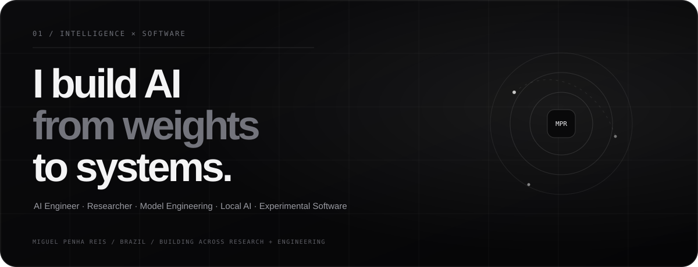

 

 

<table>
<tr>
<td width="56%" valign="top">

01 / About

I'm Miguel Penha Reis, an AI engineer and researcher working across large language models, latent reasoning, multimodal AI and software systems.

I build both the models and the systems around them, moving between research experiments and practical engineering.

My work explores what happens inside intelligent systems, how internal representations can be structured, and how those ideas can become useful tools in the real world.

Build the model. Build the system. Understand both.

</td>
<td width="44%" valign="top">

Current field

AI RESEARCH
├─ Large Language Models
├─ Latent Reasoning
├─ Multimodal AI
├─ Local Inference
├─ Retrieval Systems
└─ Experimental Software

Current emphasis: recurrent latent computation, local AI systems and end-to-end model engineering.

</td>
</tr>
</table>

02 / Flagship work

<table>
<tr>
<td width="50%" valign="top">

🧠 LeBRON

Latent recurrent reasoning for frozen decoder models.

Experimental architecture that injects recurrent computation into a structured residual subspace while keeping the pretrained backbone frozen.

PyTorch Transformers Jacobians NF4 GGUF

Focus

sparse J-Space projection

recurrent latent state

competing reasoning branches

adaptive halting

paired baseline evaluation

Open repository →

</td>
<td width="50%" valign="top">

◇ Forge3D

Local image-to-3D generation engine.

GPU-aware pipeline that turns reference images into refined, textured and validated 3D assets through multiple generative and geometry stages.

TRELLIS UltraShape FastAPI React Three.js

Pipeline

Image → Mesh → Refine → UV/PBR → GLB

Open repository →

</td>
</tr>
<tr>
<td width="50%" valign="top">

☾ Projeto Lunar

AI-powered educational ecosystem.

Multi-role platform connecting students, teachers and families through AI-assisted learning tools, dashboards, gamification, media and academic workflows.

Flask Gemini SQLAlchemy Socket.IO Edge-TTS

Open repository →

</td>
<td width="50%" valign="top">

♫ Lyra Engine

Local AI music production environment.

Music generation, local language models, multimodal workflows and memory-aware GPU orchestration in a unified desktop-oriented system.

ACE-Step Ollama Gemma Qwen Flask

Open repository →

</td>
</tr>
</table>

03 / Selected systems

Project

Area

What it explores

AGNER Browser

Desktop systems

Modular browser architecture with PyQt6 + QtWebEngine

IA RAG Nexa

Retrieval AI

Retrieval-augmented language model systems

MergeCraft

Model engineering

Experimental model merging and engineering workflows

OBSIDIAN WIRE

Cybersecurity

Security-oriented software experimentation

Lumi Motion

Creative technology

Modern video-editing workflow experimentation

HabitFlow

Personal analytics

Local-first habit tracking and long-term visual feedback

<b>More projects</b>

 

BitLoja — Bitcoin commerce experiment

FinPro SaaS — financial dashboard product

UPAÉFLIX — on-demand streaming platform

04 / Model lab

 

I also work directly on model fine-tuning, local inference and experimental model behavior.

Research / model engineering themes

SFT · GGUF · llama.cpp · quantization · coding models · multimodal models · agentic behavior · latent reasoning

05 / Stack

 

06 / Engineering philosophy

<table>
<tr>
<td width="33%" valign="top">

Research

Understand the behavior before claiming the improvement.

Controlled experiments, baselines and reproducibility matter more than impressive demos.

</td>
<td width="33%" valign="top">

Systems

A model is only part of the product.

Inference, memory, interfaces, persistence, observability and deployment are engineering problems too.

</td>
<td width="33%" valign="top">

Local-first

I like systems that users can actually control.

Local inference, quantization and efficient runtimes are recurring themes across my work.

</td>
</tr>
</table>

07 / GitHub activity

These cards are rendered by a third-party GitHub stats service and may occasionally be rate-limited.

From model weights to complete systems.

AI research · models · local inference · software engineering

 

<a href="https://github.com/guell11">GitHub</a>
  ·  
<a href="https://huggingface.co/guell00">Hugging Face</a>
  ·  
<a href="https://guell11.github.io/portifolio">Portifolio</a>

