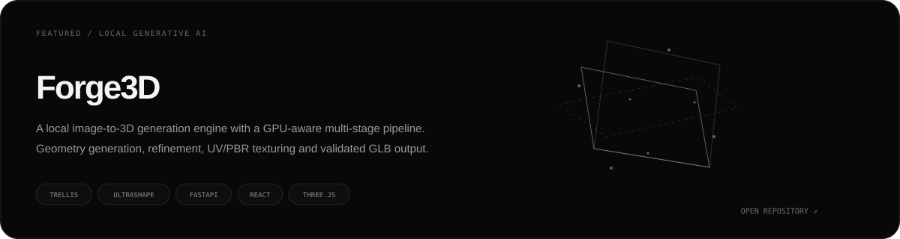
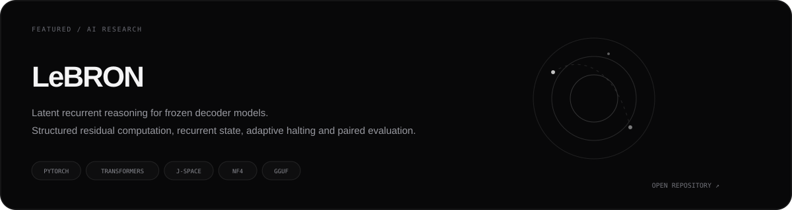
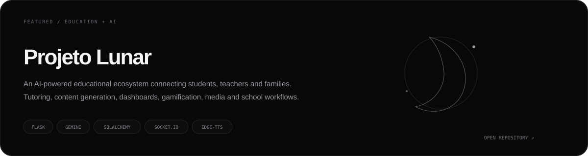
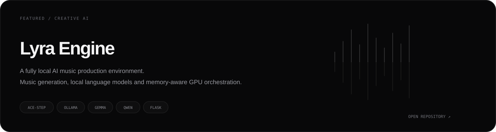
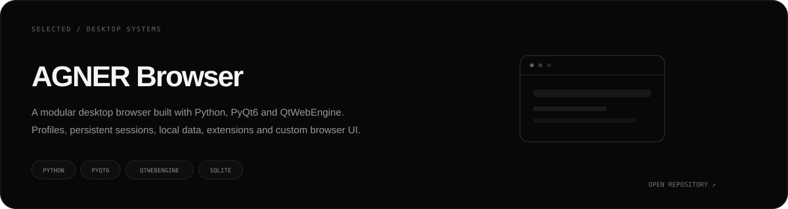
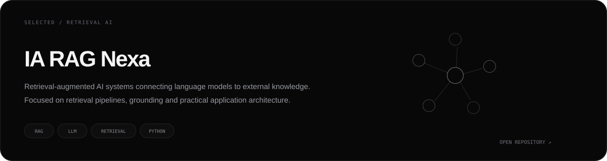
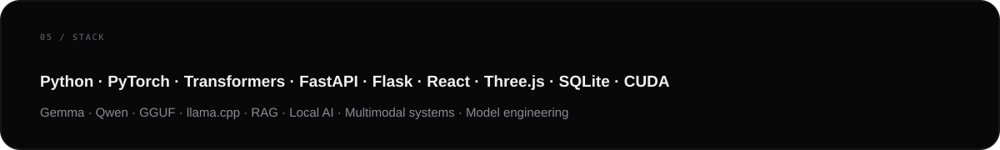

  

&nbsp;

 

 

## Featured work

 

 

 

 

## Selected systems

 

 

<b>More projects</b>

 

- **MergeCraft** — model engineering and experimental merging workflows
- **OBSIDIAN WIRE** — cybersecurity experimentation
- **Lumi Motion** — creative video tooling
- **HabitFlow** — local-first personal analytics
- **BitLoja** — Bitcoin commerce experiment
- **FinPro SaaS** — financial dashboard product
- **UPAÉFLIX** — streaming platform

 

 

 

<a href="https://guell11.github.io/portifolio/"><b>Portfolio</b></a>
&nbsp;&nbsp;·&nbsp;&nbsp;
<a href="https://github.com/guell11"><b>GitHub</b></a>
&nbsp;&nbsp;·&nbsp;&nbsp;
<a href="https://huggingface.co/guell00"><b>Hugging Face</b></a>

