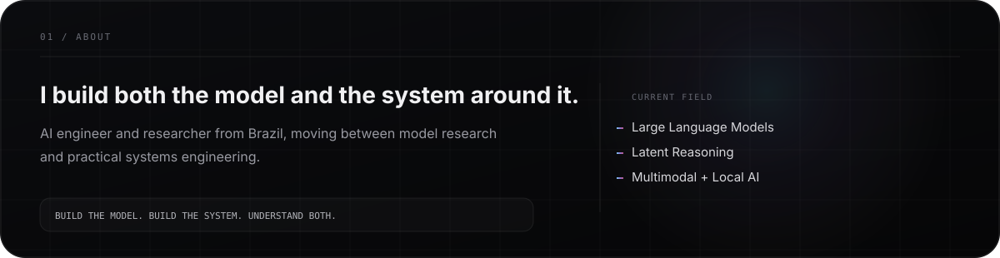
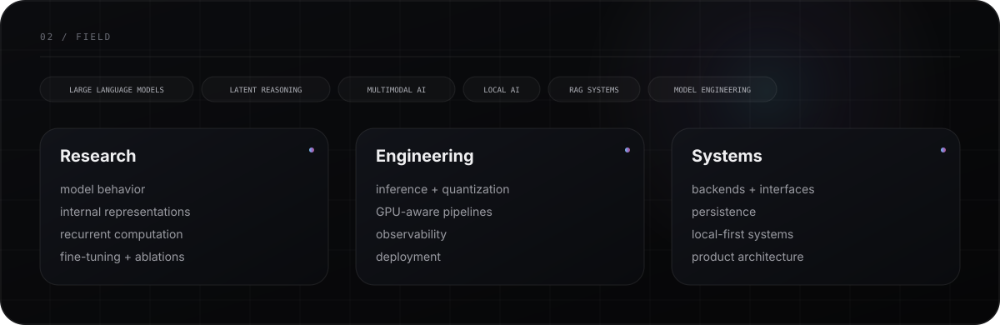
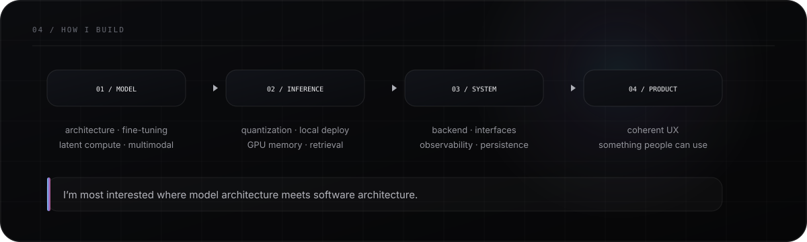
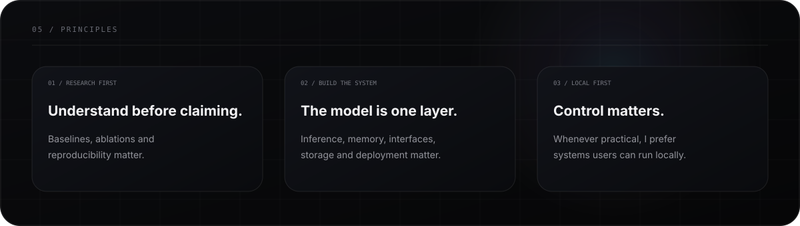
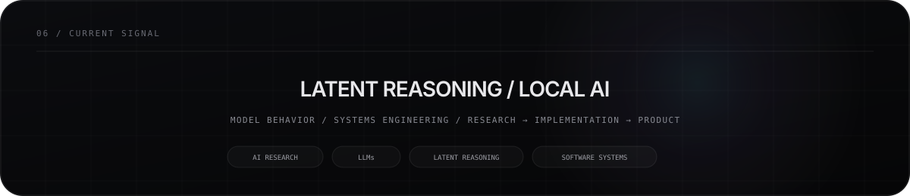
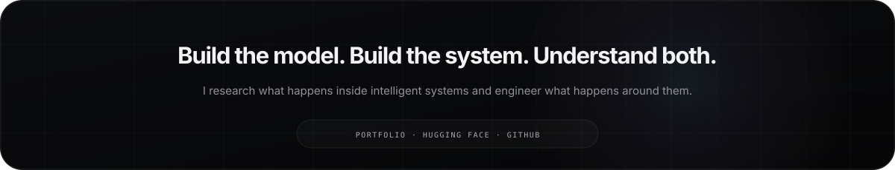

  

&nbsp;

&nbsp;

  

  

  

## `03 / TOOLBOX`

### Languages

### Frontend + Desktop

### Backend + Systems

### Data + Infrastructure

### ML + Graphics

### Models + Local AI

  

  

  

  

  

<a href="https://guell11.github.io/portifolio/"><b>Portfolio</b></a>
&nbsp;&nbsp;·&nbsp;&nbsp;
<a href="https://huggingface.co/guell00"><b>Hugging Face</b></a>
&nbsp;&nbsp;·&nbsp;&nbsp;
<a href="https://github.com/guell11"><b>GitHub</b></a>

